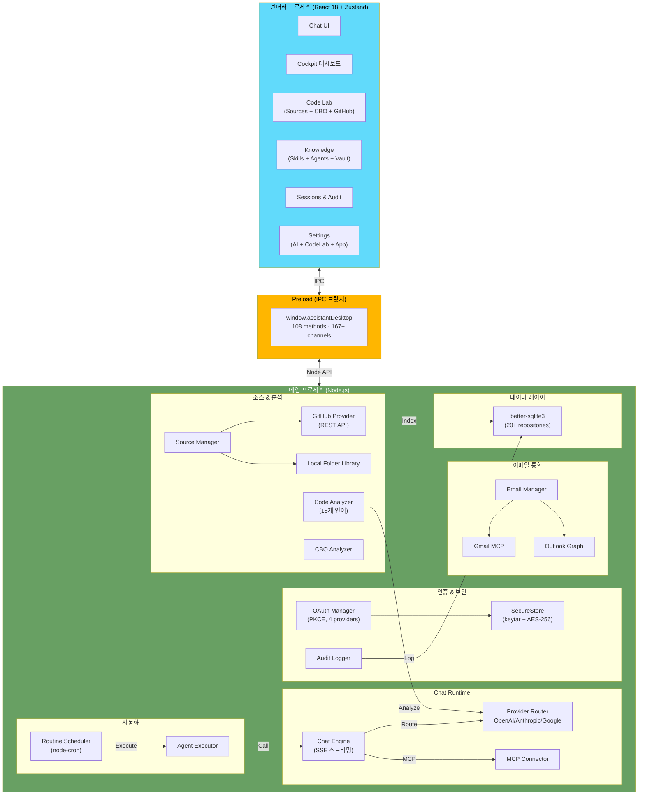

# SAP Knowledge Hub

[](https://github.com/choishiam0906/sap-assistant-desktop/releases/tag/v7.1.0)
[](./LICENSE)
[](#)
[](#)

**제조기업 운영 지원 AI 플랫폼** – 로컬 우선(Local-First) 아키텍처로 민감한 데이터를 보호하면서, MES/QMS/PMS/SAP ERP 시스템의 에러 진단과 운영 워크플로우를 AI로 지원합니다.

> 궁극적 비전: 제조기업 현업 운영자가 시스템 에러를 **AI 기반으로 자가 진단**하고, 코드/이메일/문서를 통합 분석하여 운영 업무를 지원하는 **Knowledge Hub** 플랫폼

---

## 주요 기능

### 다중 LLM 채팅
- **OpenAI**: GPT-4.1, GPT-4.1 Mini, GPT-4o, o4-mini
- **Anthropic**: Claude Sonnet 4.6, Claude Opus 4.6, Claude Haiku 4.5
- **Google**: Gemini 2.5 Flash, Gemini 2.5 Pro
- 프로바이더 선택, API 키 관리, 세션 저장

### CBO Impact 분석
- 텍스트 기반 CBO(Custom Business Object) 변경 분석
- 규칙 기반 + LLM 강화 분석
- `.txt`, `.md` 형식 지원
- 위험도 평가 및 개선 권고

### 3가지 보안 모드
| 모드 | 특징 | 용도 |
|------|------|------|
| **Secure Local** | 외부 전송 차단, 로컬 규칙 분석만 | 최대 보안 필요 환경 |
| **Reference** | 공개 지식만 외부 API 호출 | 표준 SAP 지식 질의 |
| **Hybrid Approved** | 승인된 요약본만 전송 | 기업 정책 준수 |

### 5가지 도메인 팩
| 팩 | 주요 T-Code | 용도 |
|----|-----------|----|
| **Ops Pack** | ST22, SM21, ST03N, STMS, SE03 | SAP 운영, 시스템 관리 |
| **Functional** | VL01N, ME21N, VF01, FC00 | 업무 프로세스 지원 |
| **CBO Maintenance** | SE80, SE91 | 커스터마이징 분석 |
| **PI Integration** | SXMB_MONI, ID_OWNR | PI/PO, Cloud Integration |
| **BTP/RAP/CAP** | ADT, SBPA | SAP BTP, 모던 개발 |

### 지식 관리 (Knowledge Vault)
- 기밀(Confidential) / 참고(Reference) 분류
- 소스 관리 및 버전 관리
- 정책 기반 접근 제어

### 세션 관리
- 채팅 이력 저장 및 복구
- 할 일(Todo) 상태, 라벨, 플래그
- 세션 아카이빙

### 감사 및 정책
- 모든 상호작용 로깅
- 정책 엔진 기반 규칙 집행
- 외부 전송 승인 흐름

### MCP 서버 연결
- Model Context Protocol 지원
- 확장 가능한 도구 생태계

### T-Code 기반 스킬 시스템
- SAP 트랜잭션별 컨텍스트 인식
- 도메인별 프롬프트 최적화

### CodeLab — GitHub 리포지토리 연동 (v7.1 NEW)
- **GitHub REST API 연동**: git CLI 없이 코드 파일 인덱싱 (PAT 인증)
- **SHA 기반 변경 감지**: 증분 동기화로 변경된 파일만 업데이트
- **AI 코드 분석**: 인덱싱된 소스를 LLM 컨텍스트로 활용, 에러 자가 진단 지원
- **18개 언어 지원**: TypeScript, Python, Java, Go, ABAP 등
- **파일 크기 제한**: 512KB/파일, 최대 500파일/리포지토리

### 이메일 통합 분석 (v7.0 NEW)
- **다중 프로바이더**: Gmail (MCP 브릿지), Outlook (Graph API)
- **수동 이메일 임포트**: .eml 파일 또는 텍스트 붙여넣기
- **AI 이메일 분석**: SAP 메타데이터 추출 (T-Code, 에러 코드, 시스템 ID)
- **이메일 → 마감 플랜**: 분석 결과로 자동 액션 플랜 생성

### OAuth 인증 시스템 (v7.0 NEW)
- **4대 프로바이더**: OpenAI, Anthropic, Google, Microsoft
- **PKCE 보안**: 코드 챌린지/검증 기반 OAuth 2.0
- **GitHub Device Code**: Copilot 연동용 디바이스 코드 플로우
- **시스템 키체인 + AES-256 Fallback**: keytar → 파일 암호화 이중 보호

### 코드 분석 엔진 (v7.0 NEW)
- **소스 단위/파일 단위**: 전체 리포지토리 또는 개별 파일 분석
- **진행률 추적**: 실시간 분석 진행 상태 IPC 이벤트
- **분석 이력 관리**: 분석 결과 SQLite 저장 + 조회

### 보안 강화 (v7.1 NEW)
- **Logger Redaction**: API 키, 토큰, Authorization 헤더 자동 마스킹 (pino)
- **BrowserWindow 명시 보안**: contextIsolation, sandbox, nodeIntegration 명시 선언
- **SecureStore AES-256 Fallback**: keytar 실패 시 AES-256-GCM 파일 암호화

### LLM 스트리밍 (v5.0)
- **실시간 토큰 스트리밍**: Server-Sent Events(SSE) 기반 응답 스트리밍
- **프로바이더별 지원**: OpenAI, Anthropic, Google 모두 네이티브 스트리밍

### 스케줄 자동 실행 (v5.0)
- **node-cron 기반**: 루틴 자동 실행 스케줄링 (초, 분, 시간, 요일 지원)
- **Cockpit SchedulePanel**: 스케줄 관리 UI + 즉시 실행 + 로그 조회
- **Routine Engine**: 에이전트와 스킬 자동 실행

### 에러 복원력 (v5.0)
- **Retry**: 지수 백오프 방식 재시도
- **Circuit Breaker**: 연속 실패 시 요청 차단 및 빠른 실패
- **Fallback**: 프로바이더 체인을 통한 대체 경로

### DB 마이그레이션 시스템 (v5.0)
- **MigrationRunner**: 스키마 버전 관리 (001~005+)
- **마이그레이션 추적**: migrations 테이블에 버전 기록
- **하위호환성**: 점진적 스키마 진화

### 커스텀 에이전트 & 스킬 (v4.0)
- **agent.md**: YAML frontmatter 형식으로 워크플로우 직접 정의
- **skill.md**: 맞춤형 프롬프트 템플릿 정의
- 프리셋 에이전트/스킬과 자동 병합
- 폼 기반 비주얼 에디터 + 미리보기
- 상세: [커스텀 에이전트 가이드](./docs/USER-GUIDE/CUSTOM-AGENTS.md) | [커스텀 스킬 가이드](./docs/USER-GUIDE/CUSTOM-SKILLS.md)

### 코드 랩 (Code Lab) (v4.0+)
- 소스 관리 + CBO 분석 + 아카이브 + GitHub 연동을 하나의 통합 뷰로 제공
- 탭 전환으로 빠르게 작업 컨텍스트 전환

---

## 문서

### 시작하기
| 문서 | 설명 |
|------|------|
| [GETTING-STARTED.md](./docs/GETTING-STARTED.md) | 설치, 빌드, 개발 모드 |
| [ARCHITECTURE.md](./docs/ARCHITECTURE.md) | 시스템 아키텍처, 신뢰 경계, Mermaid 다이어그램 |

### 사용자 가이드
| 문서 | 설명 |
|------|------|
| [USAGE.md](./docs/USER-GUIDE/USAGE.md) | 주요 기능별 사용법 가이드 (v5.0) |
| [DOMAIN-PACKS.md](./docs/USER-GUIDE/DOMAIN-PACKS.md) | 5가지 Domain Pack 상세 |
| [SECURITY-MODES.md](./docs/USER-GUIDE/SECURITY-MODES.md) | 3가지 보안 모드 설명 |
| [CUSTOM-AGENTS.md](./docs/USER-GUIDE/CUSTOM-AGENTS.md) | agent.md 작성 가이드 + 예제 |
| [CUSTOM-SKILLS.md](./docs/USER-GUIDE/CUSTOM-SKILLS.md) | skill.md 작성 가이드 + 예제 |

### 기획/요구사항 문서
| 문서 | 설명 |
|------|------|
| [PRD.md](./docs/PRD.md) | Product Requirements Document (v7.1.0) |
| [TRD.md](./docs/TRD.md) | Technical Requirements Document (v7.1.0) |
| [BRD.md](./docs/BRD.md) | Business Requirements Document (v7.1.0) |

### 개발자 문서
| 문서 | 설명 |
|------|------|
| [IPC-PROTOCOL.md](./docs/API/IPC-PROTOCOL.md) | 전체 IPC 채널 레퍼런스 (167+ 채널) |
| [CONTRIBUTING.md](./docs/CONTRIBUTING.md) | 코드 기여, 컨벤션, PR 규칙 |

---

## 아키텍처

### 시스템 다이어그램



### 데이터 흐름

1. **사용자 입력** → Renderer (React)
2. **IPC 메시지** → Preload (브릿지)
3. **메인 프로세스 처리**:
   - 보안 정책 검증
   - 도메인팩 선택
   - 프로바이더 라우팅
   - 로컬 분석 (필요시)
4. **응답 저장** → SQLite
5. **UI 업데이트** → Renderer

### 저장소 구조

```
src/
├── main/                           # 메인 프로세스 (Node.js)
│   ├── index.ts                    # 앱 진입점 (BrowserWindow 보안 명시)
│   ├── logger.ts                   # Pino 로거 (API 키 redaction)
│   ├── bootstrap/                  # DI 컨테이너 (팩토리 패턴)
│   │   ├── createRepositories.ts   # 데이터 저장소 초기화
│   │   ├── createServices.ts       # 비즈니스 로직 서비스 초기화
│   │   └── seedData.ts             # 초기 데이터 삽입
│   ├── auth/                       # 인증 시스템
│   │   ├── oauthManager.ts         # OAuth 2.0 + PKCE 플로우
│   │   ├── oauthProviders.ts       # 4대 프로바이더 설정
│   │   ├── secureStore.ts          # keytar + AES-256-GCM fallback
│   │   ├── fileFallback.ts         # AES 파일 암호화 저장소
│   │   ├── callbackServer.ts       # OAuth 로컬 콜백 서버
│   │   ├── githubDeviceCode.ts     # GitHub Device Code 플로우
│   │   └── pkce.ts                 # PKCE 코드 챌린지 생성
│   ├── analysis/                   # 코드 분석 엔진
│   │   └── codeAnalyzer.ts         # 소스/파일 단위 LLM 분석
│   ├── cbo/                        # CBO(Custom Business Object) 분석기
│   ├── email/                      # 이메일 통합
│   │   ├── emailManager.ts         # 이메일 동기화 + AI 분석
│   │   ├── emailAnalysisPrompt.ts  # SAP 메타데이터 추출 프롬프트
│   │   └── providers/              # Gmail MCP, Outlook Graph
│   ├── ipc/                        # IPC 핸들러 (167+ 채널)
│   │   ├── channels.ts             # 채널 상수 정의
│   │   ├── authHandlers.ts         # OAuth, API 키, Device Code
│   │   ├── chatHandlers.ts         # SSE 스트리밍, 이력 관리
│   │   ├── sourceHandlers.ts       # 소스 인덱싱, 검색
│   │   ├── emailHandlers.ts        # 이메일 동기화, 분석
│   │   ├── codeAnalysisHandlers.ts # 코드 분석 실행/조회
│   │   ├── scheduleHandlers.ts     # 스케줄 CRUD, 실행 로그
│   │   ├── agentHandlers.ts        # 에이전트 실행, 인터랙티브
│   │   ├── cboHandlers.ts          # CBO 분석 (텍스트/파일/폴더)
│   │   ├── routineHandlers.ts      # 루틴 템플릿/실행/지식 연결
│   │   ├── closingHandlers.ts      # 마감 플랜/스텝 CRUD
│   │   ├── auditHandlers.ts        # 감사 로그
│   │   ├── archiveHandlers.ts      # 아카이브 파일 I/O
│   │   └── helpers/                # CRUD 팩토리, 에러 래퍼
│   ├── providers/                  # LLM 프로바이더 라우터
│   │   ├── openai.ts               # OpenAI (GPT-4.1, GPT-4o, o4-mini)
│   │   ├── anthropic.ts            # Anthropic (Claude Opus/Sonnet)
│   │   ├── google.ts               # Google (Gemini 2.5)
│   │   └── providerResilience.ts   # Retry + Circuit Breaker + Fallback
│   ├── services/                   # 비즈니스 로직 서비스
│   │   ├── routineExecutor.ts      # 루틴 실행기
│   │   └── routineScheduler.ts     # node-cron 기반 스케줄러
│   ├── skills/                     # 스킬 시스템 (프리셋 + 커스텀)
│   ├── sources/                    # 소스 관리자
│   │   ├── sourceManager.ts        # 소스 오케스트레이션
│   │   ├── githubProvider.ts       # GitHub REST API 연동
│   │   ├── localFolderLibrary.ts   # 로컬 폴더 인덱싱
│   │   └── mcpConnector.ts         # MCP 서버 연결
│   ├── storage/                    # SQLite 저장소 + Repository 패턴
│   │   ├── db.ts                   # 데이터베이스 초기화
│   │   ├── migrationRunner.ts      # DB 마이그레이션 자동화
│   │   ├── migrations/             # 마이그레이션 스크립트
│   │   └── repositories/           # 20+ Repository (CRUD 추상화)
│   ├── types/                      # 타입 정의 (모듈별 분리)
│   └── contracts.ts                # 타입 재내보내기 (호환성)
├── preload/                        # Preload 스크립트
│   └── index.ts                    # window.assistantDesktop (108 methods)
└── renderer/                       # 렌더러 프로세스 (React 18)
    ├── components/                 # React 컴포넌트
    │   ├── settings/               # 설정 컴포넌트
    │   │   └── primitives/         # 설정 기본 UI (DRY)
    │   ├── onboarding/             # 첫 실행 온보딩
    │   └── email/                  # 이메일 UI 컴포넌트
    ├── hooks/                      # 커스텀 React 훅 (React Query 래퍼)
    ├── pages/                      # 페이지 컴포넌트 (라우팅)
    │   ├── sources/                # 소스 페이지 (Local, MCP, GitHub)
    │   ├── settings/               # 설정 (AI, CodeLab, App, Appearance)
    │   ├── cockpit/                # 대시보드 (Schedule, Closing)
    │   ├── chat/                   # 채팅 컴포넌트
    │   ├── cbo/                    # CBO 분석
    │   └── __tests__/              # 페이지 테스트
    ├── stores/                     # Zustand 상태 관리 (persist)
    ├── styles/                     # CSS 변수 기반 디자인 시스템
    │   └── variables.css           # 색상, 간격, 타이포그래피 변수
    └── App.tsx                     # 앱 진입점
```

---

## 기술 스택

| 계층 | 기술 | 버전 |
|------|------|------|
| **전자** | Electron | 31.x |
| **프론트엔드** | React | 18.x |
| **상태 관리** | Zustand | 5.x |
| **데이터 페칭** | React Query | 5.x |
| **언어** | TypeScript | 5.7 |
| **번들러** | Vite | 6.x |
| **백엔드** | Node.js | 22.x LTS |
| **데이터베이스** | better-sqlite3 | 11.x |
| **로깅** | Pino | 8.x |
| **LLM SDK** | Model Context Protocol | 1.27.x |
| **UI 스타일** | CSS 변수 시스템 (Tailwind 미사용) | - |
| **테스트** | Vitest + React Testing Library | - |
| **스케줄** | node-cron | 1.3.x |
| **시스템 키체인** | keytar | 8.x |

---

## 빠른 시작

### 필수 요구사항

- **Node.js** 22.22.1 LTS 권장 (`.nvmrc`, `.node-version` 제공)
- **npm** 10.9.4 이상
- **Windows** 10 이상 (Electron 31 호환)
- **메모리**: 최소 4GB RAM
- **디스크**: 설치 후 최소 500MB 여유 공간

### 1단계: 설치

```bash
# 저장소 클론
git clone https://github.com/choishiam0906/sap-assistant-desktop.git
cd sap-assistant-desktop

# 런타임 확인
npm run check:runtime

# 의존성 설치 (Electron 네이티브 모듈 자동 재빌드 포함)
npm install
# 주의: desktop/ 래퍼 폴더 제거됨 (v5.0부터 루트 직접 관리)
```

### 2단계: 환경 설정

```bash
# .env 파일 생성
cp .env.example .env

# .env 파일 편집 (API 키 입력)
# OPENAI_API_KEY=sk-...
# ANTHROPIC_API_KEY=sk-ant-...
# GOOGLE_API_KEY=...
```

### 3단계: 앱 실행

```bash
# 개발 모드: 메인 프로세스만 핫 리로드
npm run dev

# 프로덕션 빌드 후 실행 (권장)
npm run build && npm run start
```

> `npm run start`는 Electron과 충돌할 수 있는 `NODE_OPTIONS`를 정리한 뒤 빌드된 앱을 실행합니다.
> `npm run dev`는 메인 프로세스를 tsx로 핫 리로드하며 실행합니다.

### 4단계: 빌드 및 배포

```bash
# 프로덕션 빌드
npm run build

# 앱 시작 (빌드 후)
npm run start

# Windows 배포
# 1. 포터블 실행 파일 (exe 단일 파일)
npm run dist:portable

# 2. NSIS 설치 프로그램
npm run dist:nsis

# 또는 모든 배포 포맷
npm run dist
```

---

## 설정 (.env)

### 필수 환경 변수

```env
# LLM 프로바이더 API 키
OPENAI_API_KEY=sk-...
ANTHROPIC_API_KEY=sk-ant-...
GOOGLE_API_KEY=...

# 애플리케이션
APP_NAME=SAP Knowledge Hub
APP_VERSION=7.1.0

# 개발/프로덕션
NODE_ENV=development|production

# 데이터베이스
DB_PATH=./data/app.db

# 로깅
LOG_LEVEL=debug|info|warn|error
```

### 선택 환경 변수

```env
# OAuth Client ID (프로바이더별 OAuth 로그인 활성화)
OAUTH_OPENAI_CLIENT_ID=...
OAUTH_ANTHROPIC_CLIENT_ID=...
OAUTH_GOOGLE_CLIENT_ID=...
OAUTH_MICROSOFT_CLIENT_ID=...

# MCP 서버 연결
MCP_SERVER_URL=http://localhost:3000
MCP_API_KEY=...

# 프록시 (기업 환경)
HTTP_PROXY=http://proxy:port
HTTPS_PROXY=https://proxy:port
```

자세한 설정은 [`.env.example`](./.env.example)을 참조하세요.

---

## 사용 가이드

### 1단계: 보안 모드 선택

**Settings** > **Security** 에서 모드 선택:

- **Secure Local** (기본값): 로컬 PC에서만 처리, 외부 전송 차단
- **Reference**: 표준 SAP 지식 질의, 공개 LLM 모델 사용
- **Hybrid Approved**: 승인된 요약본만 외부 전송

### 2단계: 도메인팩 선택

**Chat** 페이지에서 상황에 맞는 팩 선택:

```
Ask SAP
├─ Ops Pack           → 운영/시스템 관리 질문
├─ Functional Pack    → 업무 프로세스 지원
├─ CBO Maintenance    → CBO 변경 분석
├─ PI Integration     → 통합/연동 질문
└─ BTP/RAP/CAP       → 모던 SAP 개발
```

### 3단계: 채팅 또는 분석

#### 채팅 모드
1. 질문 입력 또는 업로드된 문서 첨부
2. 프로바이더/모델 선택
3. 응답 수신 및 세션 저장

#### CBO 분석 모드
1. **CBO Analysis** 페이지 접속
2. `.txt` 또는 `.md` 파일 업로드
3. 분석 유형 선택:
   - **규칙 기반**: 로컬 검사만 (빠름)
   - **LLM 강화**: + AI 분석 (상세)
4. 결과 확인 및 권고사항 검토

### 4단계: Knowledge Vault 관리

**Knowledge Vault** 페이지:

- **Reference**: 공개 자료 (SAP 문서, 블로그, 포럼)
- **Confidential**: 기업 내부 자료 (정책, 아키텍처)

파일 업로드 → 자동 분류 → 검색 가능

### 5단계: 세션 및 감사

**Sessions & Audit** 페이지:

- 과거 대화 복구
- 감시 로그 조회 (타임스탬프, 모델, 비용)
- 세션 아카이빙
- 정책 위반 추적

---

## 도메인 팩 상세

### Ops Pack

**목적**: SAP 시스템 운영, 성능, 보안 지원

**주요 T-Code**:
- `ST22` – 단기 덤프 분석
- `SM21` – 시스템 로그
- `ST03N` – 워크로드 분석
- `STMS` – 수송 관리
- `SE03` – 변경 관리
- `SM50` – 프로세스 모니터링
- `SM37` – 배치 작업 모니터링

**사용 시나리오**:
- 시스템 성능 저하 진단
- 에러 덤프 해석
- 배치 작업 실패 원인 분석
- 사용자 권한 설정

### Functional Pack

**목적**: 업무 프로세스 및 표준 기능 지원

**주요 T-Code**:
- `VL01N` – 배송 생성
- `VL02N` – 배송 변경
- `VF01` – 청구서 생성
- `ME21N` – 구매 발주
- `VD01` – 고객 마스터
- `FC00` – 재무 대시보드

**사용 시나리오**:
- T-Code 업무 흐름 설명
- 마스터 데이터 관리 절차
- 오류 메시지 해석
- 업무 절차 최적화

### CBO Maintenance Pack

**목적**: 커스터마이징 객체(CBO) 변경 분석 및 위험 평가

**주요 T-Code**:
- `SE80` – ABAP 개발 워크벤치
- `SE91` – 메시지 유지보수
- `SE38` – 프로그램 에디터
- `SMOD` – 확장 포인트

**입력 형식**: `.txt` 또는 `.md` (CBO 정의, 코드 변경)

**분석 결과**:
- 규칙 기반 위험도 평가
- 성능 영향 예측
- 의존성 분석
- 권고사항

### PI Integration Pack

**목적**: SAP PI/PO 및 Cloud Integration 지원

**주요 T-Code**:
- `SXMB_MONI` – 메시지 모니터링
- `SXMB_IFR` – Integration Builder
- `ID_OWNR` – Integration Directory
- `PIIS` – PI Integration Suite

**사용 시나리오**:
- 메시지 흐름 설계
- 통합 오류 진단
- 매핑 및 변환 검토
- 클라우드 통합 아키텍처

### BTP/RAP/CAP Pack

**목적**: SAP BTP, ABAP RESTful Application Programming(RAP), Cloud Application Programming(CAP) 개발 지원

**주요 T-Code** / **도구**:
- `ADT` – ABAP Development Tools (Eclipse)
- `SBPA` – BTP Admin 콘솔
- `FIORI` – Fiori 앱 런처
- SAP Build Work Zone

**사용 시나리오**:
- 클라우드 앱 개발 모범 사례
- RAP 엔티티 설계
- CAP 프로젝트 구조
- BTP 서비스 통합

---

## 보안 모델

### Secure Local Mode (로컬 보안 모드)

```
┌─────────────────────────────────────┐
│ 사용자 입력 (질문/파일)              │
└────────────┬────────────────────────┘
             │
             ▼
┌─────────────────────────────────────┐
│ 정책 엔진: "외부 전송 가능?"          │
│ → 판정: NO                           │
└────────────┬────────────────────────┘
             │
             ▼
┌─────────────────────────────────────┐
│ 로컬 분석만 실행:                    │
│ • CBO 규칙 기반 분석                 │
│ • 정규표현식 패턴 매칭              │
│ • 로컬 Knowledge 검색               │
└────────────┬────────────────────────┘
             │
             ▼
┌─────────────────────────────────────┐
│ 결과 반환 (외부 API 호출 불가)      │
└─────────────────────────────────────┘
```

**특징**:
- 모든 처리가 로컬 PC에서 진행
- 인터넷 연결 불필요
- 외부 서버 전송 차단
- 민감 데이터 유출 불가능

### Reference Mode (참고 모드)

```
┌──────────────────────────────────────┐
│ 사용자 입력 (공개 지식 질문)          │
└────────────┬─────────────────────────┘
             │
             ▼
┌──────────────────────────────────────┐
│ 정책 엔진: "공개 정보만 포함?"       │
│ → 판정: YES                          │
└────────────┬─────────────────────────┘
             │
             ▼
┌──────────────────────────────────────┐
│ 선택된 프로바이더로 라우팅:          │
│ • OpenAI GPT-4o                      │
│ • Anthropic Claude Opus              │
│ • Google Gemini 2.5                  │
└────────────┬─────────────────────────┘
             │
             ▼
┌──────────────────────────────────────┐
│ 로컬 + 외부 LLM 분석                 │
│ (공개 컨텍스트만 전송)               │
└────────────┬─────────────────────────┘
             │
             ▼
┌──────────────────────────────────────┐
│ 결과 반환 및 로깅                    │
└──────────────────────────────────────┘
```

**특징**:
- 표준 SAP 지식만 외부 전송
- API 키 기반 인증
- 기업 정책 설정 가능
- 감시 로그 기록

### Hybrid Approved Mode (하이브리드 승인 모드)

```
┌───────────────────────────────────────┐
│ 사용자 입력 (민감할 수 있는 질문)    │
└────────────┬──────────────────────────┘
             │
             ▼
┌───────────────────────────────────────┐
│ 민감성 스캔:                          │
│ • 회사명, 부서, 개인정보 제거        │
│ • 기밀 정보 마스킹                   │
└────────────┬──────────────────────────┘
             │
             ▼
┌───────────────────────────────────────┐
│ 승인 프로세스:                        │
│ ✓ 자동 승인 (정책 기준)              │
│ ✓ 관리자 승인 필요 (위험도 높음)     │
└────────────┬──────────────────────────┘
             │
             ▼
┌───────────────────────────────────────┐
│ 승인된 요약본만 외부 LLM 전송        │
│ (원문 소스는 로컬에만 유지)          │
└────────────┬──────────────────────────┘
             │
             ▼
┌───────────────────────────────────────┐
│ 결과 반환 및 감시 로그 기록          │
│ (승인 기록 포함)                     │
└───────────────────────────────────────┘
```

**특징**:
- 민감정보 자동 탐지 및 제거
- 승인 워크플로우 (자동/수동)
- 기업 정책 준수
- 완전한 감시 추적

---

## npm 스크립트

```bash
# 개발
npm run check:runtime    # Node/npm 런타임 확인
npm run dev              # 메인 프로세스 개발 실행 (tsx)
npm run build:renderer   # React 빌드 (Vite)
npm run build:main      # Electron Main 빌드

# 프로덕션 빌드
npm run build           # build:main + build:renderer
npm run start           # 빌드된 앱 실행 (충돌하는 NODE_OPTIONS 자동 정리)

# 패키징
npm run pack            # 앱 패킹 (dist/ 생성)
npm run dist            # 모든 설치 관계자 생성
npm run dist:portable   # 포터블 EXE (exe 단일 파일)
npm run dist:nsis       # NSIS 설치 프로그램 (msi)

# 검증
npm run lint            # ESLint 린트
npm run typecheck       # TypeScript 타입 체크
npm run test            # 테스트 스위트 (감시 모드)
npm run test:run        # 테스트 한 번 실행
npm run test:coverage   # 커버리지 리포트
npm run verify          # lint + typecheck + test:run 순서 실행
```

---

## 보안 정책

### 민감 파일 보호

**절대 커밋하지 말 것**:
- `.env`, `.env.local` (API 키)
- `data/` (사용자 데이터)
- `dist/` (빌드 산출물)
- `node_modules/`

**확인 항목**:
- `.gitignore` 설정 확인
- `.env.example` 사용 (예시만)
- GitHub Secrets 사용 (CI/CD)

### API 키 관리

1. **로컬 개발**:
   ```bash
   # .env 파일 (git 무시됨)
   OPENAI_API_KEY=sk-...
   ANTHROPIC_API_KEY=sk-ant-...
   ```

2. **프로덕션 배포**:
   - 환경 변수를 통해 제공
   - 난독화 또는 보안 저장소 사용

### 데이터 암호화

- SQLite 데이터베이스: 암호화되지 않음 (로컬 저장)
- 네트워크 전송: HTTPS 전송만 (LLM API)
- 파일 저장: 관리자 권한 필요

---

## 기여 가이드

### 브랜치 전략 (Git Flow)

```
main (프로덕션)
  ↑
develop (개발 통합)
  ↑
feature/* (기능 개발)
  ↑
hotfix/* (긴급 버그)
```

### 커밋 메시지 규칙

**Conventional Commits** 사용:

```
feat(도메인): 간단한 설명
fix(도메인): 버그 설명
refactor(도메인): 리팩토링 설명
docs: 문서 업데이트
test: 테스트 추가
chore: 빌드, 의존성 등

예시:
feat(chat): OpenAI 스트리밍 지원 추가
fix(cbo): 규칙 분석 엣지 케이스 수정
docs(readme): 빠른 시작 가이드 추가
```

### Pull Request 프로세스

1. **포크 및 브랜치 생성**:
   ```bash
   git checkout -b feature/my-feature develop
   ```

2. **코드 작성 및 커밋**:
   ```bash
   git add .
   git commit -m "feat(domain): description"
   ```

3. **검증**:
   ```bash
   npm run verify       # lint + typecheck + test
   ```

4. **푸시 및 PR**:
   ```bash
   git push origin feature/my-feature
   # GitHub에서 PR 생성 (develop 대상)
   ```

5. **PR 체크리스트**:
   - [ ] 테스트 작성/수정
   - [ ] 타입 체크 통과
   - [ ] 린트 통과
   - [ ] 문서 업데이트
   - [ ] Co-Authored-By 헤더 포함

### 테스트

```bash
# 테스트 작성 (Jest/Vitest)
# __tests__/ 또는 .test.ts 파일

# 테스트 실행
npm run test            # 감시 모드
npm run test:run        # 한 번 실행
npm run test:coverage   # 커버리지 리포트

# 최소 커버리지: 70% (src/)
```

### 코드 스타일

- **TypeScript** strict mode 필수
- **Prettier** 자동 포맷팅
- **ESLint** 린트 규칙 준수
- 함수형 프로그래밍 선호 (불변성, 순수함수)

---

## 문제 해결

### 일반 문제

#### 앱이 실행되지 않음
```bash
# 1. 의존성 재설치
rm -rf node_modules package-lock.json
npm install

# 2. 캐시 삭제
npm run clean
npm install

# 3. 포트 충돌 확인 (기본: 3000, 5173)
lsof -i :3000
```

#### 빌드 실패
```bash
# 1. 환경 확인
node --version  # v18+ 필요
npm --version   # 9+ 필요

# 2. 의존성 업데이트
npm update

# 3. 캐시 삭제
npm cache clean --force
npm install
```

#### 데이터베이스 오류
```bash
# 1. DB 파일 확인
ls -la ./data/app.db

# 2. 권한 확인
chmod 644 ./data/app.db

# 3. 초기화 (데이터 손실!)
rm ./data/app.db
npm run dev  # 자동 재생성
```

### LLM API 문제

#### API 키 인증 실패
```bash
# 1. .env 파일 확인
cat .env | grep API_KEY

# 2. API 제공자 대시보드 확인
# OpenAI: https://platform.openai.com/account/api-keys
# Anthropic: https://console.anthropic.com/account/keys
# Google: https://console.cloud.google.com/

# 3. API 할당량 확인
# 초과 시: 빌링 정보 업데이트 필요
```

#### 느린 응답
```bash
# 1. 모델 확인
# GPT-4.1 > Claude Opus > Gemini (속도 순)

# 2. 프로바이더 지역 확인
# US 리전이 권장됨

# 3. 네트워크 지연 확인
ping api.openai.com
```

### 성능 최적화

```bash
# 1. 메모리 사용량 확인
npm run dev  # DevTools 열기 (F12)

# 2. 번들 크기 분석
npx webpack-bundle-analyzer

# 3. SQLite 최적화
# 정기적으로 VACUUM 실행 (Settings > Database)
```

---

## 라이선스

[MIT License](./LICENSE) – 자유로운 사용, 수정, 배포 가능

**조건**:
- 라이선스 및 저작권 표시 유지
- 책임 부인 포함

---

## 참고 자료

### 공식 문서
- [Electron 문서](https://www.electronjs.org/docs)
- [React 18 가이드](https://react.dev)
- [TypeScript 핸드북](https://www.typescriptlang.org/docs/)
- [Vite 가이드](https://vitejs.dev)

### SAP 자료
- [SAP Help Portal](https://help.sap.com)
- [SAP BTP 문서](https://help.sap.com/docs/btp)
- [ABAP Development 가이드](https://help.sap.com/docs/abap-development)

### 커뮤니티
- [GitHub Discussions](https://github.com/choishiam0906/sap-assistant-desktop/discussions)
- [SAP 커뮤니티](https://community.sap.com)
- [Stack Overflow - SAP](https://stackoverflow.com/questions/tagged/sap)

---

## 로드맵

### Phase 1: 수동 워크플로우 (v4.0 — ✅ 완료)

- ✅ 다중 LLM 통합 (OpenAI, Anthropic, Google)
- ✅ CBO 분석 + 소스코드 아카이브
- ✅ 에이전트/스킬 시스템 (프리셋 + 커스텀)
- ✅ 코드 랩 (Sources + CBO + Archive 통합)
- ✅ Knowledge Vault + MCP 서버 연결
- ✅ Cockpit (마감 관리 + 루틴)

### Phase 2: 자동화 & 품질 (v5.0 — ✅ 완료)

- ✅ 스케줄 기반 에이전트 실행 (node-cron)
- ✅ DB 마이그레이션 시스템
- ✅ LLM SSE 스트리밍
- ✅ 에러 복원력 (Retry + Circuit Breaker + Fallback)
- ✅ 코드 품질 개선 (Zustand 최적화, IPC 팩토리, bootstrap 분해)

### Phase 3: 플랫폼 성숙 (v6.0~v6.1 — ✅ 완료)

- ✅ UI 대형 컴포넌트 분할 (ProcessHub 1149→277줄 등)
- ✅ 접근성(a11y) 강화 (ARIA, useFocusTrap, useKeyboardNav)
- ✅ React Query 최적화 (queryKeys 팩토리, 도메인별 캐싱)
- ✅ Zustand persist 통일 (수동 localStorage → 미들웨어)
- ✅ 범용 플랫폼 전환 (Domain Pack 시스템, 타입/IPC 범용화)
- ✅ esbuild CJS 번들링 (Electron portable/NSIS 호환)

### Phase 4: 지식 허브 (v7.0~v7.1 — ✅ 현재)

- ✅ SAP Knowledge Hub 리브랜딩
- ✅ OAuth 4대 프로바이더 (OpenAI, Anthropic, Google, Microsoft)
- ✅ GitHub 코드 연동 (CodeLab REST API 통합)
- ✅ 이메일 통합 분석 (Gmail MCP, Outlook Graph, AI 분석)
- ✅ 코드 분석 엔진 (소스/파일 단위 LLM 분석)
- ✅ 보안 강화 (Logger Redaction, AES-256 Fallback, BrowserWindow 명시)
- ✅ OAuth `state` 파라미터 버그 수정 (OpenAI 호환)

### Phase 5: 엔터프라이즈 (향후 계획)

- [ ] SAP 시스템 직접 연결 (RFC/OData)
- [ ] 자동 Transport 리뷰 & 승인 흐름
- [ ] GitLab 리포지토리 연동
- [ ] 오프라인 LLM (Ollama 연동)
- [ ] 엔터프라이즈 배포 (LDAP, SSO, 코드 서명)
- [ ] auto-updater 코드 서명 인증서

---

## 문의 및 지원

### 버그 신고
- [GitHub Issues](https://github.com/choishiam0906/sap-assistant-desktop/issues)
- 템플릿: `[BUG] 제목` 또는 `[FEATURE] 제목`

### 토론
- [GitHub Discussions](https://github.com/choishiam0906/sap-assistant-desktop/discussions)

### 커뮤니티
- [SAP 커뮤니티](https://community.sap.com)
- [Stack Overflow - SAP](https://stackoverflow.com/questions/tagged/sap)

---

**Made with care for SAP Professionals**

© 2024-2026 SAP Knowledge Hub Contributors. All rights reserved.
