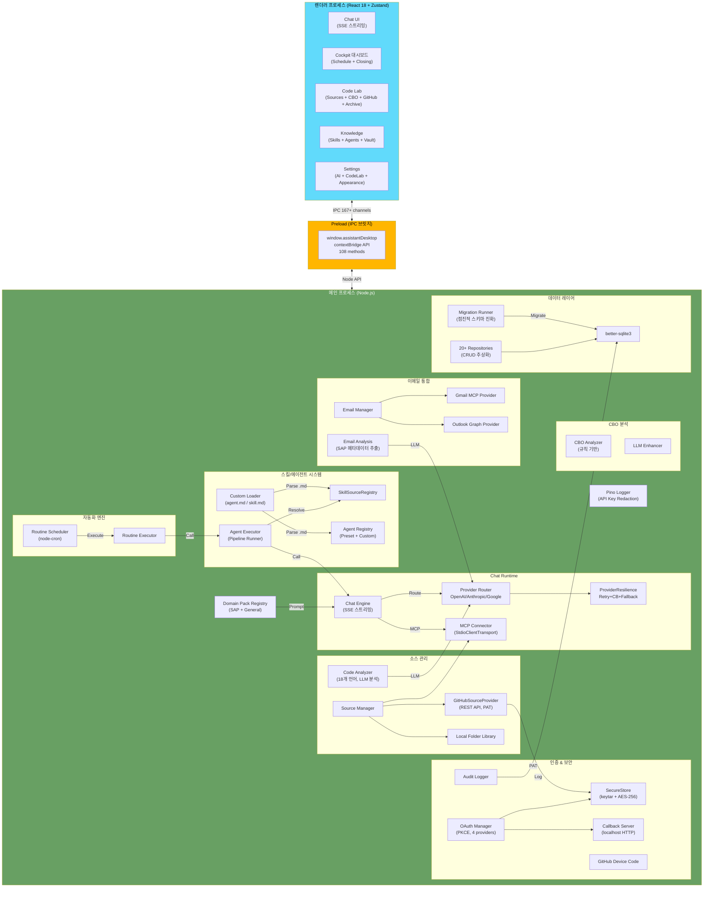
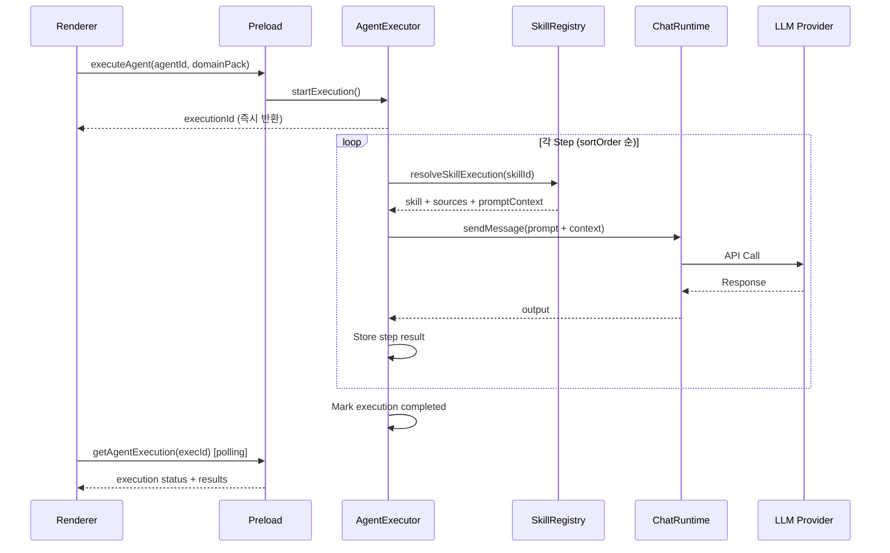

# Enterprise Knowledge Hub — Architecture

## Overview

Enterprise Knowledge Hub는 **Electron 31 + React 18 + TypeScript 5.7** 기반의 로컬 우선(Local-First) 데스크톱 앱입니다. 민감한 제조기업 운영 데이터를 로컬에 보관하면서 다중 LLM(OpenAI, Anthropic, Google)을 활용한 지능형 운영 지원을 제공합니다.

**v8.0.0 기준**: 167+ IPC 채널, 108 preload 메서드, 13개 핸들러 모듈, 20+ Repository

---

## 시스템 다이어그램



---

## 신뢰 경계 (Trust Boundary)

| 경계 | 설명 |
|------|------|
| **Renderer → Preload** | `contextBridge.exposeInMainWorld`로 노출된 API만 사용 |
| **Preload → Main** | `ipcRenderer.invoke` → `ipcMain.handle` 채널 기반 통신 |
| **Main → 외부** | 보안 모드(Secure Local/Reference/Hybrid)에 따라 외부 API 호출 제한 |
| **Custom Files → Runtime** | `gray-matter`로 YAML frontmatter 파싱, 스키마 검증 후 로드 |
| **OAuth → Provider** | PKCE(S256) 코드 챌린지, state 파라미터 CSRF 방지 |
| **Credentials → Storage** | keytar(시스템 키체인) 우선, AES-256-GCM 파일 fallback |

### 보안 원칙
- Renderer에서 Node.js 직접 접근 불가 (`nodeIntegration: false`, `sandbox: true`)
- 자격증명은 시스템 키체인(keytar) 저장, 실패 시 AES-256-GCM 파일 암호화
- SQLite 쿼리는 항상 바인딩 변수 사용
- 커스텀 agent.md/skill.md는 프롬프트 템플릿만 포함, 코드 실행 불가
- Logger에서 API 키, 토큰, Authorization 헤더 자동 redaction

---

## 프로세스 구조

### Main Process
- Electron 앱 진입점 (`src/main/index.ts`)
- BrowserWindow 보안 명시: `contextIsolation`, `sandbox`, `nodeIntegration`
- IPC 핸들러 등록 (`src/main/ipc/` — 13개 모듈)
- SQLite 데이터베이스 + Migration Runner
- LLM 프로바이더 라우팅 + 에러 복원력
- OAuth Manager (4 프로바이더) + SecureStore
- Source Manager (GitHub, Local, MCP)
- Email Manager (Gmail MCP, Outlook Graph)
- Code Analyzer (소스/파일 LLM 분석)
- Routine Scheduler (node-cron)

### Preload Process
- `contextBridge`를 통한 IPC 브릿지 (`src/preload/index.ts`)
- `window.assistantDesktop` API 노출 (108 메서드)
- 이벤트 리스너: 스트리밍, 진행률, 에이전트 상태

### Renderer Process
- React 18 SPA (`src/renderer/`)
- Zustand 상태 관리 (persist 미들웨어) + React Query 데이터 페칭
- CSS 변수 기반 디자인 시스템 (다크 모드 지원)
- 설정 페이지 레지스트리 패턴 (`settings-pages.ts`)

---

## 데이터 흐름

### Agent 실행 파이프라인



### GitHub 코드 인덱싱 플로우

```
IT 관리자 설정                    AI 진단 흐름
┌──────────────────┐    ┌───────────────────────────────────────┐
│ Settings CodeLab │    │ GitHubSourceProvider                   │
│ ├─ Repo URL      │───▶│  ├─ GET /repos/{owner}/{repo}         │
│ └─ PAT 입력      │    │  ├─ GET /git/trees/{sha}?recursive=1  │
│                  │    │  ├─ GET /contents/{path} (병렬 5개)    │
│                  │    │  └─ upsertDocuments → SQLite           │
└──────────────────┘    └──────────────┬────────────────────────┘
                                       │
┌──────────────────┐    ┌──────────────▼────────────────────────┐
│ End User         │    │ source_documents (code as context)     │
│ "엑셀 업로드     │───▶│  └─ CodeAnalyzer + Chat AI             │
│  에러 났어요"    │    │     → "엑셀 형식이 안 맞는 것 같아요"   │
└──────────────────┘    └───────────────────────────────────────┘
```

### 이메일 분석 플로우

```
이메일 동기화                     AI 분석 → 액션
┌──────────────────┐    ┌───────────────────────────────────────┐
│ Email Manager    │    │ 수신 이메일                             │
│ ├─ Gmail MCP     │───▶│  ├─ SAP 메타데이터 추출               │
│ └─ Outlook Graph │    │  │  (T-Code, 에러코드, 시스템ID)       │
│   or 수동 임포트 │    │  ├─ LLM 분석 (Claude Opus)            │
└──────────────────┘    │  └─ 마감 플랜 자동 생성               │
                        └───────────────────────────────────────┘
```

---

## 디렉토리 구조

```
src/
├── main/                          # Electron 메인 프로세스
│   ├── index.ts                   # 앱 진입점 (BrowserWindow 보안)
│   ├── logger.ts                  # Pino 로거 (redaction)
│   ├── config.ts                  # AppConfig (환경 변수 매핑)
│   ├── contracts.ts               # 타입 재내보내기
│   ├── bootstrap/                 # DI 컨테이너
│   │   ├── createRepositories.ts
│   │   ├── createServices.ts
│   │   └── seedData.ts
│   ├── auth/                      # 인증 시스템
│   │   ├── oauthManager.ts        # OAuth 2.0 + PKCE
│   │   ├── oauthProviders.ts      # 4대 프로바이더 설정
│   │   ├── secureStore.ts         # keytar + AES fallback
│   │   ├── fileFallback.ts        # AES-256-GCM 파일 암호화
│   │   ├── callbackServer.ts      # OAuth 로컬 HTTP 서버
│   │   ├── githubDeviceCode.ts    # GitHub Device Code
│   │   └── pkce.ts                # PKCE 코드 챌린지
│   ├── analysis/                  # 코드 분석
│   │   └── codeAnalyzer.ts
│   ├── agents/                    # 에이전트 시스템
│   │   ├── registry.ts            # 프리셋 에이전트
│   │   ├── executor.ts            # 파이프라인 실행기
│   │   ├── agentFileParser.ts     # agent.md 파싱
│   │   └── agentLoaderService.ts  # 파일 시스템 로더
│   ├── skills/                    # 스킬 시스템
│   │   ├── registry.ts            # SkillSourceRegistry
│   │   ├── skillFileParser.ts     # skill.md 파싱
│   │   └── skillLoaderService.ts  # 파일 시스템 로더
│   ├── email/                     # 이메일 통합
│   │   ├── emailManager.ts        # 이메일 오케스트레이션
│   │   ├── emailAnalysisPrompt.ts # SAP 메타데이터 LLM 프롬프트
│   │   └── providers/             # Gmail MCP, Outlook Graph
│   ├── cbo/                       # CBO 분석기
│   ├── ipc/                       # IPC 핸들러 (13개 모듈)
│   │   ├── channels.ts            # 167+ 채널 상수
│   │   ├── index.ts               # registerAllIpcHandlers()
│   │   ├── types.ts               # IpcContext (DI 인터페이스)
│   │   └── helpers/               # CRUD 팩토리, 에러 래퍼
│   ├── providers/                 # LLM 프로바이더
│   │   ├── openai.ts
│   │   ├── anthropic.ts
│   │   ├── google.ts
│   │   └── providerResilience.ts  # Retry + CB + Fallback
│   ├── services/                  # 비즈니스 로직
│   │   ├── routineExecutor.ts
│   │   └── routineScheduler.ts    # node-cron
│   ├── sources/                   # 소스 관리
│   │   ├── sourceManager.ts       # 오케스트레이션
│   │   ├── githubProvider.ts      # GitHub REST API
│   │   ├── localFolderLibrary.ts  # 로컬 폴더
│   │   └── mcpConnector.ts        # MCP 서버
│   ├── storage/                   # SQLite 저장소
│   │   ├── db.ts
│   │   ├── migrationRunner.ts
│   │   ├── migrations/
│   │   └── repositories/          # 20+ Repository
│   └── types/                     # 모듈별 타입 정의
├── preload/                       # IPC 브릿지
│   └── index.ts                   # window.assistantDesktop (108 methods)
└── renderer/                      # React UI
    ├── pages/
    │   ├── assistant/             # 채팅/분석/아카이브/코드랩
    │   ├── knowledge/             # 에이전트/스킬 카탈로그 + 에디터
    │   ├── settings/              # AI/CodeLab/App/Appearance 설정
    │   ├── cockpit/               # 대시보드 (Schedule, Closing)
    │   └── sources/               # 소스 관리 (Local, MCP, GitHub)
    ├── stores/                    # Zustand 상태 (persist)
    ├── components/                # 공통 컴포넌트
    │   ├── settings/primitives/   # 설정 UI 라이브러리
    │   └── onboarding/            # 첫 실행 온보딩
    └── styles/                    # CSS 변수 기반 디자인 시스템
```

---

## 기술 스택 요약

| 계층 | 기술 | 역할 |
|------|------|------|
| Runtime | Electron 31 | 데스크톱 앱 프레임워크 |
| Frontend | React 18 + TypeScript 5.7 | UI 렌더링 |
| State | Zustand 5 + React Query 5 | 상태 관리 + 서버 상태 |
| Database | better-sqlite3 | 로컬 데이터 저장 (20+ 테이블) |
| Auth | keytar + AES-256-GCM | 시스템 키체인 + 파일 암호화 |
| OAuth | PKCE + Device Code | 4대 프로바이더 인증 |
| LLM | OpenAI / Anthropic / Google | 다중 프로바이더 |
| Protocol | MCP SDK 1.27 | 도구 확장 (StdioClientTransport) |
| Email | Gmail MCP + Outlook Graph | 이메일 동기화/분석 |
| VCS | GitHub REST API | 코드 인덱싱 |
| Parsing | gray-matter | YAML frontmatter 파싱 |
| Logging | Pino 8 | 구조화 로깅 + API 키 redaction |
| Scheduling | node-cron | 루틴 자동 실행 |
| Build | Vite 6 + esbuild | 번들링 (CJS 호환) |
| Test | Vitest | 테스트 프레임워크 |
| Installer | electron-builder | NSIS + Portable EXE |

---

## 변경 이력

| 버전 | 아키텍처 변경 |
|------|-------------|
| v8.0.0 | 제품명 리브랜딩 (SAP Knowledge Hub → Enterprise Knowledge Hub), 벡터 DB RAG 시스템 |
| v7.1.0 | GitHub 코드 연동, 보안 강화 (AES fallback, Logger redact, BrowserWindow 명시) |
| v7.0.0 | OAuth 4대 프로바이더, 이메일 통합, 코드 분석 엔진, SAP Knowledge Hub 리브랜딩 |
| v6.1.0 | Domain Pack 시스템, 타입/IPC 범용화, 범용 플랫폼 전환 |
| v6.0.0 | UI 분할, a11y, React Query 최적화, Zustand persist 통일, esbuild CJS |
| v5.0.0 | SSE 스트리밍, 스케줄러, 에러 복원력, DB 마이그레이션 |
| v4.0.0 | 에이전트/스킬 시스템, 커스텀 agent.md/skill.md, Code Lab, MCP 연결 |
